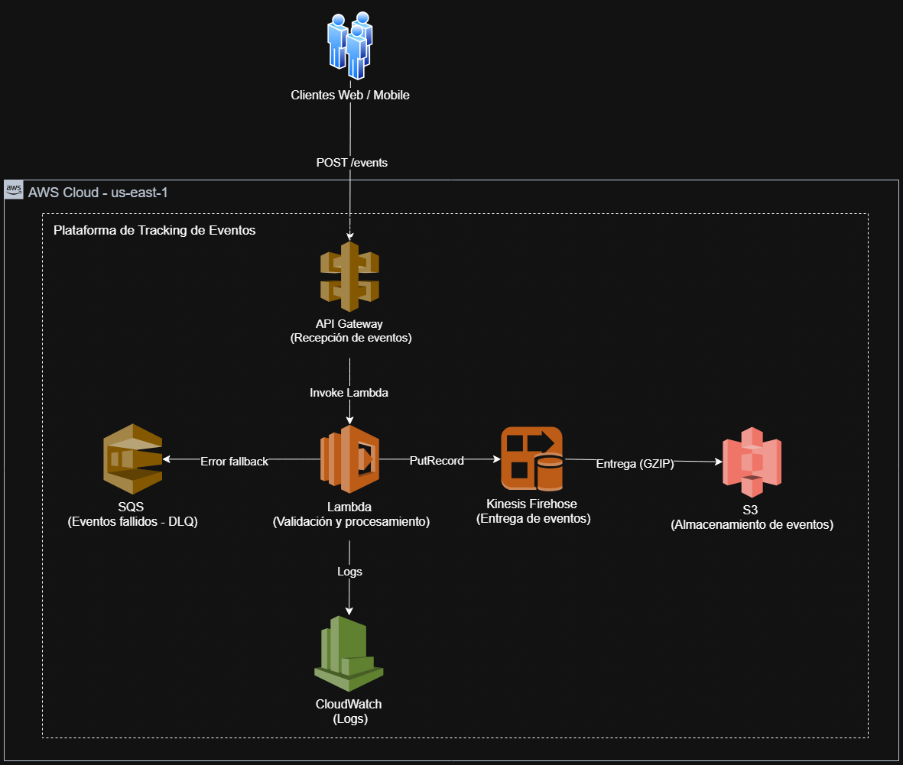

# Arquitectura de la Plataforma de Tracking de Eventos

## Diagrama de arquitectura

---

## Descripción general

La solución implementa una arquitectura serverless en AWS para la captura, procesamiento y almacenamiento de eventos generados por aplicaciones Web y Mobile.

El flujo está diseñado para ser altamente disponible, escalable y resiliente ante fallos.

---

## Flujo de datos

1. Los clientes (Web/Mobile) envían eventos mediante una petición HTTP `POST /events`.
2. API Gateway recibe la solicitud y la enruta hacia una función Lambda.
3. La función Lambda:
   - Valida el evento
   - Agrega metadatos (event_id, timestamp)
   - Procesa la información
4. Si el evento es válido:
   - Se envía a Kinesis Firehose (`PutRecord`)
   - Firehose agrupa, comprime (GZIP) y entrega los eventos a S3
5. Si ocurre un error:
   - El evento se envía a SQS (DLQ) para análisis posterior
6. Todos los eventos procesados generan logs en CloudWatch

---

## Componentes principales

### API Gateway

Actúa como punto de entrada para recibir eventos desde clientes externos mediante HTTP.

### AWS Lambda

Encargada de la validación, procesamiento y ruteo de eventos hacia los sistemas de almacenamiento o fallback.

### Kinesis Data Firehose

Servicio administrado para la entrega de eventos hacia S3, incluyendo buffering y compresión.

### Amazon S3

Almacenamiento durable de eventos, organizado y listo para consumo por equipos de datos.

### Amazon SQS (DLQ)

Cola de mensajes para eventos fallidos, permitiendo su inspección y reprocesamiento.

### Amazon CloudWatch

Sistema de monitoreo y logging para observar el comportamiento del sistema.

---

## Decisiones de diseño

### Arquitectura serverless

Se eligió un enfoque serverless para evitar la gestión de infraestructura, mejorar la escalabilidad automática y optimizar costos.

### Firehose sobre Kinesis Streams

Firehose reduce la complejidad operativa al eliminar la necesidad de consumidores manuales.

### Uso de DLQ

Permite resiliencia ante fallos y evita pérdida de eventos.

### Separación de flujos

Se distingue claramente entre:

- Flujo exitoso (persistencia en S3)
- Flujo de error (DLQ)

---

## Escalabilidad

- API Gateway escala automáticamente con el tráfico
- Lambda maneja concurrencia de forma automática
- Firehose absorbe picos de eventos
- S3 ofrece almacenamiento prácticamente ilimitado

---

## Disponibilidad

- Arquitectura sin punto único de falla en el path de ingesta
- Servicios completamente administrados por AWS

---

## Seguridad

- Comunicación mediante HTTPS
- Validación mediante API Key
- Encriptación en reposo en S3
- IAM con principio de menor privilegio

---

## Observabilidad

- Logs estructurados en CloudWatch
- Monitoreo del comportamiento de la función Lambda
- Inspección de errores mediante SQS (DLQ)

---

## Posibles mejoras

- Autenticación avanzada (Cognito, OAuth)
- Gestión de esquemas de eventos
- Integración con Glue y Athena
- Alertas y métricas avanzadas en CloudWatch
- Reprocesamiento automático de eventos desde la DLQ
